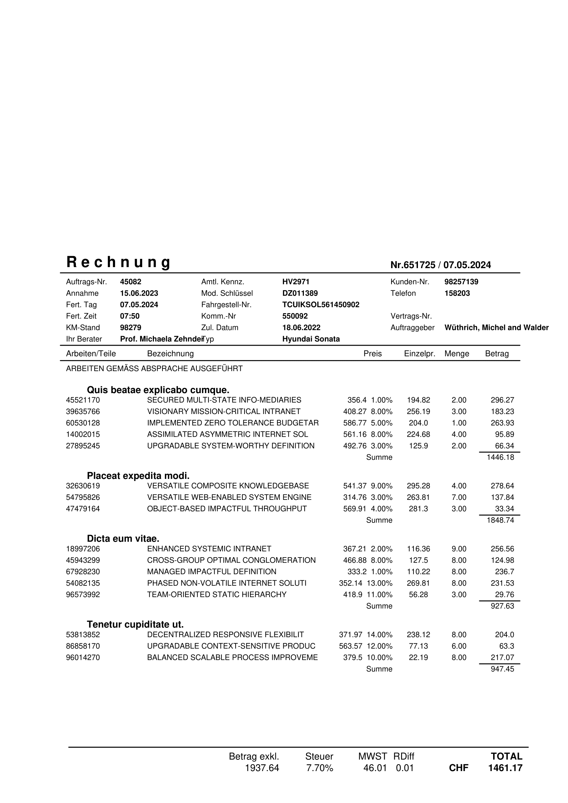

# Synthetic Invoice Generator App
This Streamlit application generates synthetic garage invoice data for model training purposes. It allows users to specify the number of invoices to generate and select between different invoice templates. The generated invoices include both PDF and JSON formats, with structured data for header, items, and summary sections.

The generated JSON format adheres to the required annotation specifications for training data used in Donut 🍩: Document Understanding Transformer.



## Features
- Generate multiple invoices in PDF format.
- Corresponding JSON files for each invoice with structured data.
- Select between different invoice templates.
-  Download all generated invoices and JSON files as a ZIP archive.
  
## Installation
### Prerequisites
- Python 3.10 or higher
- Streamlit
- Required Python packages (listed in requirements.txt)
  
### Setup
1. Clone the repository:
```bash
git clone https://github.com/mattdepaolis/invoice-generator-app.git
cd invoice-generator-app
```

2. Create a virtual environment and activate it:
```bash
python -m venv venv
source venv/bin/activate  # On Windows, use `venv\Scripts\activate`
```

3. Install the required packages:
```bash
pip install -r requirements.txt
```

4. Run Streamlit app:
```bash
streamlit run app.py
```

## Usage
1. Open the Streamlit app in your web browser.
2. Use the sidebar to select the invoice template and enter the number of invoices you want to generate.
3. Click the "Generate Invoices" button to start the generation process.
4. Once the invoices are generated, download the ZIP archive containing all the PDFs and JSON files.

## File Structure
```plaintext
invoice-generator-app/
│
├── app.py                     # Main application file
├── requirements.txt           # Python dependencies
├── pdf_generation_module.py   # Module for generating garage invoices
├── images/                    # Image of a generated invoice
├── temp_invoices/             # Temporary directory for storing generated files
├── README.md                  # This README file
└── .gitignore                 # Git ignore file
```

### Contributing
1. Fork the repository.
2. Create a new branch (git checkout -b feature-branch).
3. Make your changes.
4. Commit your changes (git commit -am 'Add new feature').
5. Push to the branch (git push origin feature-branch).
6. Create a new Pull Request.

### License
This project is licensed under the MIT License.
